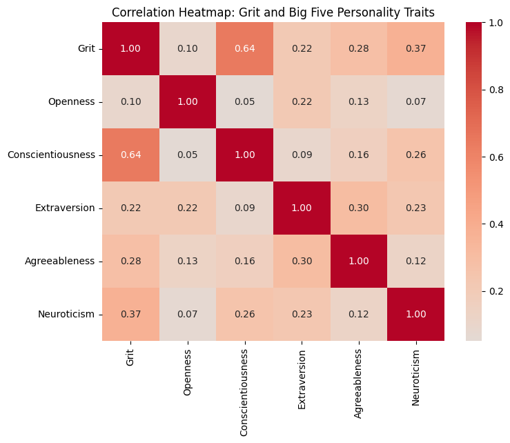
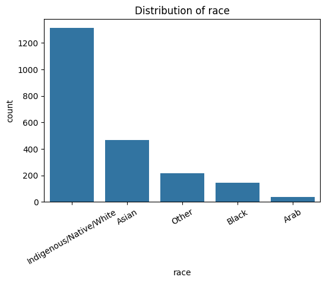
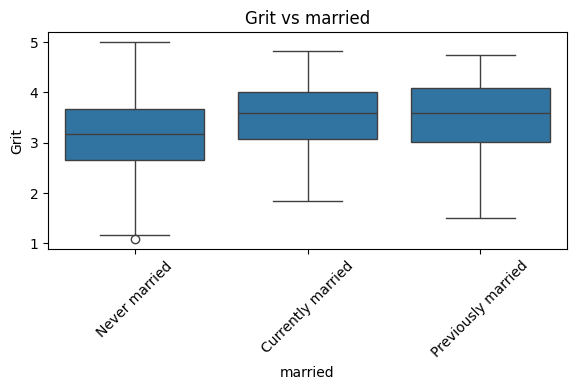
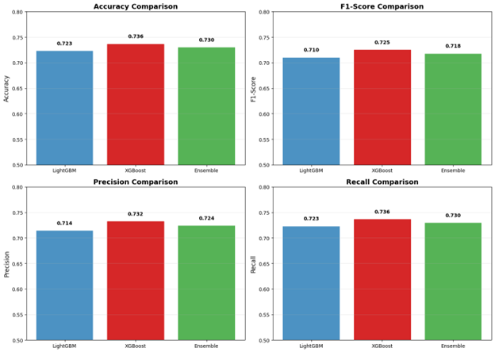
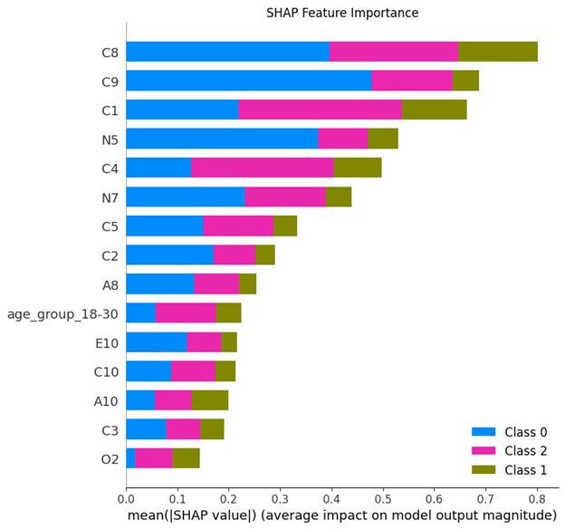
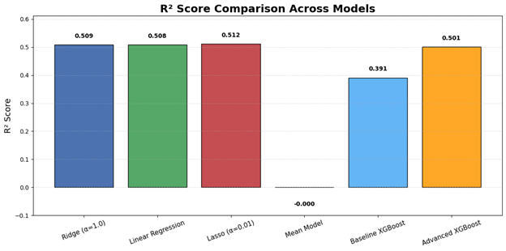
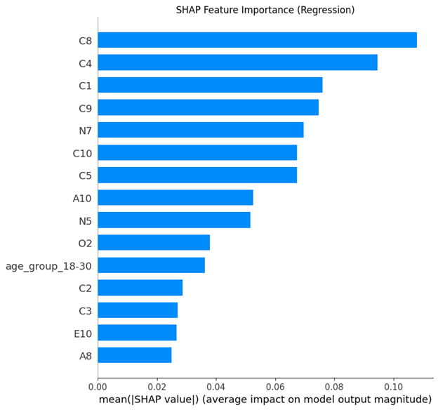

# SRI – Predicting and Measuring Grit in Leaders

## **Team Members**

| Name    | GitHub Handle | Contribution                                                                 |
| ------- | ------------- | ---------------------------------------------------------------------------- |
| Rishik  | @Rishik15     | Baseline Modeling, Feature Selection, Streamlit Application                     |
| Fida    | @fibi5        | EDA, Data Preprocessing, Regression Model Training and Tuning, Task Management |
| Rithika | @rashok1      | Data Cleaning/Preprocessing, EDA, Classification Model Training              |
| Annie   | @annie251     | EDA, Data Cleaning, Data Preprocessing, Documentation                        |
| Amal    | @AmalBilal1   | EDA, Data Preprocessing                                                      |

## Project Overview

Investors often rely on both financial data and leadership qualities when making funding decisions. Leadership plays a critical role in a company’s success, and research shows that “grit”—a combination of perseverance and passion—is a strong predictor of long-term success.

This project explores methods to estimate grit in individuals, especially leaders (e.g., CEOs), with the ultimate goal of designing a lightweight, data-driven grit survey that can support investment decision-making.

## Problem Statement

We aim to answer two key questions:

1. **What are the main predictors of grit in an individual?**
2. **Can we design a survey that reliably estimates whether or not an individual demonstrates grit?**

##  **Data Exploration**

The dataset used in this project was sourced from Kaggle and originates from OpenPsychometrics.org, a nonprofit platform dedicated to psychological research and public education:

- **Source** – Duckworth Grit Scale Responses https://www.kaggle.com/datasets/lucasgreenwell/duckworth-grit-scale-responses/data
- **Format** – CSV
- **Shape** – 4,270 rows × 98 columns
- **Size** – 950 KB


**The dataset includes**:

- **Big Five Personality Responses** - Participants rated 50 personality items (10 per trait: Extraversion, Neuroticism, Agreeableness, Conscientiousness, Openness) on a 5-point scale
- **Angela Duckworth’s Grit Scale Responses** - Participants answered 12 grit-related items measuring perseverance and consistency of interests, rated on a 5-point scale
- **Vocabulary Checklist (VCL)** - A word recognition task used as a validity check, including both real and non-real words.
- **Demographic & Background Information** - Variables such as age, gender, education level, native language, country, and family size.
- **Technical Metadata** - Information such as time spent on each survey page, browser type, operating system, and screen resolution.

The primary objective of the data exploration phase was to identify which specific Big Five survey questions are most predictive of an individual’s grit score.

**To ensure high-quality, meaningful data for modeling we**:

- Removed participants who failed the vocabulary check (indicating careless responses).  
- Filtered out rows with unreasonable survey completion times:
  - testelapse: 75–2000 seconds  
  - introelapse: 0–800 seconds  
  - surveyelapse: 72–2000 seconds  
- Replaced missing demographic values with "unknown".  
- Filtered out participants under 18 years old, extreme ages, and unrealistic family sizes.  
- Calculated aggregate grit and personality scores for each participant.  
- Filled missing survey responses with the median.  

**Exploratory analyses included**:

- Distribution of missing values and survey responses.  
- Validation of internal consistency for each scale.  
- Correlations between personality traits and grit. Conscientiousness was strongly correlated with grit.


- Demographic distributions revealed skew: most participants were female, white, Christian, heterosexual, right-handed, and lived in the US.


  - Most demographic variables had low correlation with grit, except for age, education, and marital status.

- To ensure fairness and inclusivity, only married, age, and family size were included as demographic features, removing variables that reflect access or background rather than ability.


##  **Model Development**

### **Baseline Models**

**Classification**  
- **Goal:** Predict grit class from survey responses.  
- **Models:** Dummy classifier, Logistic Regression (L1/L2)  
- **Results:** Logistic regression outperformed dummy (~50% accuracy). L1 slightly better than L2.  
- **Insight:** Survey questions contain meaningful predictive signals.  

**Regression**  
- **Goal:** Predict grit score.  
- **Models:** Dummy (mean), Linear, Ridge, Lasso Regression  
- **Results:** All outperformed dummy; models similar in performance.  
- **Insight:** Feature engineering needed to improve predictions.  

### **Feature Selection**

**Techniques:** Correlation filtering, L1-regularization, RFE  
**Goal:** Identify top 15 features most predictive of grit (classification & regression)  
**Features Considered:** Big Five items (E1–E10, N1–N10, etc.), age, marital status, vocab score  


### **Advanced Models**

**Classification (High/Medium/Low grit)**  
- **Models:** LightGBM, XGBoost, Ensemble  
- **Best:** XGBoost — Accuracy 0.736, F1 0.725  
- **Insight:** Top 15 features capture strong predictive signal for grit class.

**Regression (XGBoost)**  
- **Untuned:** MAE_test 0.414, R²_test 0.391  
- **Tuned (Optuna):** MAE_test 0.392, R²_test 0.500  
- **Insight:** Tuning improved generalization; top features drive predictions.  


##  **Results & Key Findings**






## **Next Steps**

### **Regression Model Limitations & Future Improvements**

While the final regression model (XGBoost) achieves solid and competitive performance, several limitations and opportunities for improvement remain:

- Future work could explore leveraging XGBoost’s built-in feature importance metrics or SHAP-based feature ranking to select the top predictors in a way that is more tightly aligned with the model’s internal decision-making process.
- Additional performance gains may be possible through feature engineering, such as:
  - Interaction features between key personality traits
  - Nonlinear transformations of existing variables
  - Aggregated or composite features that better capture behavioral patterns
- While XGBoost was chosen for its strong performance and robustness, experimenting with alternative models (e.g., ensemble stacking, neural networks, or regularized nonlinear models) may further improve predictive accuracy or generalizability.

### **Streamlit App Future Improvements**

The Streamlit prototype successfully demonstrates how a lightweight grit survey could be administered in practice, but there are still improvements that can be made with the user interface & design.

## **License**

MIT License

Copyright (c) 2025 SRI – Predicting and Measuring Grit in Leaders

Permission is hereby granted, free of charge, to any person obtaining a copy
of this software and associated documentation files (the "Software"), to deal
in the Software without restriction, including without limitation the rights
to use, copy, modify, merge, publish, distribute, sublicense, and/or sell
copies of the Software, and to permit persons to whom the Software is
furnished to do so, subject to the following conditions:

The above copyright notice and this permission notice shall be included in all
copies or substantial portions of the Software.

## **Acknowledgements**

We would like to thank everyone who supported this project:

- **Challenge Advisors:** John Cook and Henry L. Wright, for providing the industry challenge and guidance throughout the project.  
- **Coach:** Elizabeth Parnell, for her invaluable support and assistance whenever we encountered issues.  

## Tech Stack

- **Python** (pandas, scikit-learn, SHAP, matplotlib/seaborn)
- **Jupyter Notebooks** for data exploration & model building
- **Streamlit** for prototype survey app
- **Git/GitHub** for version control & collaboration

## **Setup and Installation**

### 1. Clone the repository

First, clone the project repository to your local machine using Git:

```bash
git clone https://github.com/Rishik15/BTT_GM2.git
```

After cloning, move into the project directory:

```
cd BTT_GM2
```

### 2. Create and activate a virtual environment (optional but recommended)

```bash
python -m venv venv
source venv/bin/activate      # macOS / Linux
venv\Scripts\activate         # Windows
```

### 3. Install dependencies

From the project root directory:

```bash
pip install -r requirements.txt
```

### 4. Navigate to the Streamlit app folder

```bash
cd streamlit_app
```

### 5. Run the app

```bash
streamlit run app.py
```

The app will be available at http://localhost:8501.
To stop the app, press Ctrl + C.
